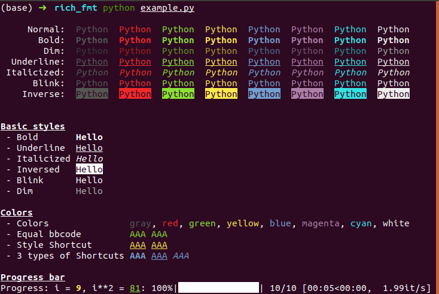

# Simple BBcode to terminal converter

A simple bbcode to terminal converter, can also be used in progress bar, jupyter notebook

### Install

Just copy __rich_fmt.py__ to your project

```bash
pip install bbcode tqdm
```

### Screenshot



### Styles
colors: gray, red, green, yellow, blue, magenta, cyan, white
|  Style     | BBCode               |
|  ----      | ----                 |
| Bold       | [b]Hello[/b]         |
| Underline  | [u]Hello[/u]         |
| Italicized | [i]Hello[/i]         |
| Inversed   | [inv]Hello[/inv]     |
| Blink      | [blink]Hello[/blink] |
| Dim        | [dim]Hello[/dim]     |
| Color      | [color=green]Hello[/color] |

### Shortcuts
|  Style     | BBCode               |
|  ----      | ----                 |
| coloring | [color=green]AAA[/color]  == [green]AAA[/green] 
| conbine styles | [yellow][u]AAA[/u][/yellow] == [u_yellow]AAA[/u_yellow]
| 3 types of Shortcuts | [b_blue]AAA[/b_blue] [u_blue]AAA[/u_blue] [i_blue]AAA[/i_blue] 
